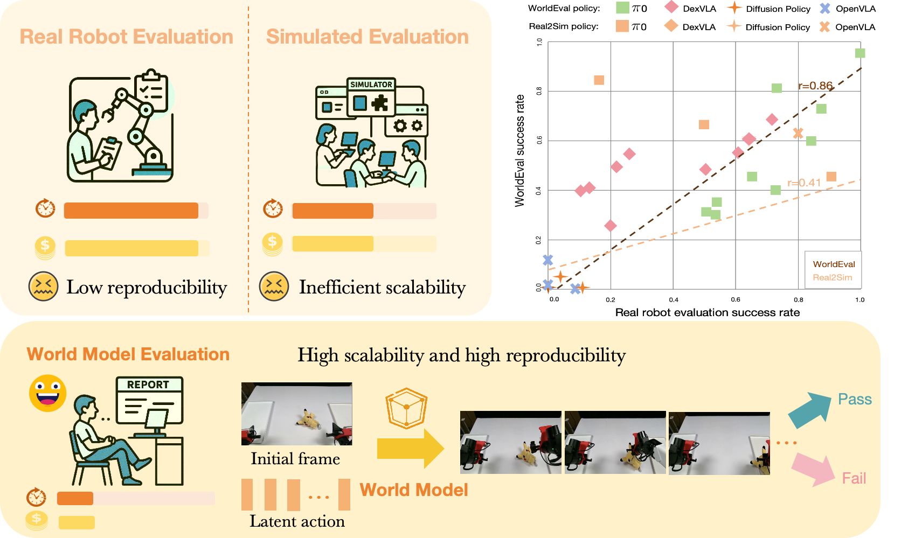
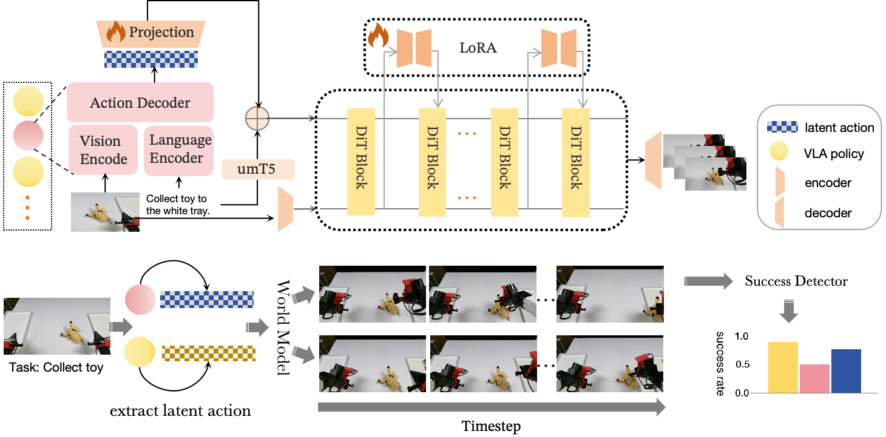

<h1 align="center">
WorldEval: World Model as Real-World Robot Policies Evaluator</h1>


* **World Model as Real-World Robot Policies Evaluator** <br>
  [](https://arxiv.org/abs/)
  
<p align="center">
   &nbsp;
</p>

<p align="center">

</p>

## 📰 News
* **`May. 19th, 2025`**: Our code is released!
* **`May. 19th, 2025`**: **Worldeval** is out! **Paper** can be found [here](https://arxiv.org/abs/2409.12514). The **project web** can be found [here](https://worldeval.github.io/).


## Data Preparation
Our robot trajectory data format is the same as [act](https://github.com/MarkFzp/act-plus-plus), so you need to transfer your data into h5py format.
```angular2html
# h5 data structure
root
  |-action (100,14)
  |-language_raw (1,)
  |-substep_reasonings(100,)
  |-observations
      |-images # multi-view
          |-cam_left_wrist (100,480,640,3)
          |-cam_right_wrist (100,480,640,3)
          |-cam_high (100,480,640,3)
      |-joint_positions (100,14)
      |-qpos (100,14)
      |-qvel (100,14)
```
## Download Pretrained VLA Policy
The weights of vla policy used in our paper are listed as following: 

| Model               | Link                                                           |
|---------------------|----------------------------------------------------------------|
| Pi0 | [huggingface](https://huggingface.co/kuromivv/pi0) |
| DexVLA | [huggingface](https://huggingface.co/kuromivv/DexVLA) |
| Diffusion Policy | [huggingface](https://huggingface.co/kuromivv/diffusion_policy) |


## Download WAN2.1 Weights
Wan-Video is a collection of video synthesis models open-sourced by Alibaba.
|Developer|Name|Link|Scripts|
|-|-|-|-|
|Wan Team|14B image-to-video 480P|[Link](https://modelscope.cn/models/Wan-AI/Wan2.1-I2V-14B-480P)|[wan_14b_image_to_video.py](./wan_14b_image_to_video.py)|
|Wan Team|14B image-to-video 720P|[Link](https://modelscope.cn/models/Wan-AI/Wan2.1-I2V-14B-720P)|[wan_14b_image_to_video.py](./wan_14b_image_to_video.py)|


## Install

please install Worldeval from **source code**.

```shell
git clone https://github.com/worldeval/Worldeval.git
cd Worldeval
pip install -e .
```

Wan-Video supports multiple Attention implementations. If you have installed any of the following Attention implementations, they will be enabled based on priority.

* [Flash Attention 3](https://github.com/Dao-AILab/flash-attention)
* [Flash Attention 2](https://github.com/Dao-AILab/flash-attention)
* [Sage Attention](https://github.com/thu-ml/SageAttention)
* [torch SDPA](https://pytorch.org/docs/stable/generated/torch.nn.functional.scaled_dot_product_attention.html) (default. `torch>=2.5.0` is recommended.)

## Train

### Step 1: Organize your dataset

You need to organize the HDF5 files containing the robot trajectory data as follows:

```
data/example_dataset/
├── metadata.csv
└── train (empty dir to store processed tensor)
```

`metadata.csv`:

```
file_path,file_name,text
/path/to/episode_0.hdf5,episode_0.hdf5,""
```

### Step 2: Data process

```bash
cd wanvideo
```

run `scripts/data_process.sh`

```shell
#! /bin/bash
CUDA_VISIBLE_DEVICES="0,1,2,3,4,5,6,7" python train_wan_t2v_act_embed.py \
  --task data_process \
  --dataset_path data/dex2_example_dataset \
  --output_path ./models \
  --text_encoder_path "Wan2.1-I2V-14B-480P/models_t5_umt5-xxl-enc-bf16.pth" \
  --image_encoder_path "Wan2.1-I2V-14B-480P/models_clip_open-clip-xlm-roberta-large-vit-huge-14.pth" \
  --vae_path "Wan2.1-I2V-14B-480P/Wan2.1_VAE.pth" \
  --tiled \
  --num_frames 81 \
  --height 480 \
  --width 832 \
  --encode_mode dexvla \
  --action_encoded_path data/dex2_example_dataset/train/all_actions_dex.pt
```

After that, some cached files will be stored in the dataset folder.

```
data/example_dataset/
├── metadata.csv
└── train
    ├── file1.hdf5.tensors.pth
    └── file2.hdf5.tensors.pth
```

### Step 3: Run lora training script

Run  `scripts/train.bash`: 

 ```shell
CUDA_VISIBLE_DEVICES="0,1,2,3,4,5,6,7" \
python train_wan_t2v.py \
  --task train \
  --train_architecture lora \
  --dataset_path data/example_dataset \
  --output_path ./models \
  --dit_path "Wan2.1-I2V-14B-480P/diffusion_pytorch_model-00001-of-00007.safetensors,Wan2.1-I2V-14B-480P/diffusion_pytorch_model-00002-of-00007.safetensors,Wan2.1-I2V-14B-480P/diffusion_pytorch_model-00003-of-00007.safetensors,Wan2.1-I2V-14B-480P/diffusion_pytorch_model-00004-of-00007.safetensors,Wan2.1-I2V-14B-480P/diffusion_pytorch_model-00005-of-00007.safetensors,Wan2.1-I2V-14B-480P/diffusion_pytorch_model-00006-of-00007.safetensors,Wan2.1-I2V-14B-480P/diffusion_pytorch_model-00007-of-00007.safetensors" \
  --image_encoder_path "Wan2.1-I2V-14B-480P/models_clip_open-clip-xlm-roberta-large-vit-huge-14.pth" \
  --steps_per_epoch 500 \
  --max_epochs 40 \
  --learning_rate 1e-4 \
  --lora_rank 16 \
  --lora_alpha 16 \
  --lora_target_modules "q,k,v,o,ffn.0,ffn.2,action_alpha,action_proj.0,action_proj.2"\
  --accumulate_grad_batches 1 \
  --use_gradient_checkpointing

```   
please separate the safetensor files with a comma. For example: `models/Wan-AI/Wan2.1-T2V-14B/diffusion_pytorch_model-00001-of-00006.safetensors,models/Wan-AI/Wan2.1-T2V-14B/diffusion_pytorch_model-00002-of-00006.safetensors,models/Wan-AI/Wan2.1-T2V-14B/diffusion_pytorch_model-00003-of-00006.safetensors,models/Wan-AI/Wan2.1-T2V-14B/diffusion_pytorch_model-00004-of-00006.safetensors,models/Wan-AI/Wan2.1-T2V-14B/diffusion_pytorch_model-00005-of-00006.safetensors,models/Wan-AI/Wan2.1-T2V-14B/diffusion_pytorch_model-00006-of-00006.safetensors`.

## Inference

### Step1: Extract action embeddings

Extract action embeddings using different VLA policies, prepare the encoded actions, and save them in a .pt file with the following structure:

```
{
  "file_path": ["path/to/file1.hdf5", "path/to/file2.hdf5"],
  "encoded_action": [latent_action_vector1, latent_action_vector2]
}
```

### Step2: Sample frames

Use `utils/sample_frames_from_dir_for_test` to extract sample frames from the HDF5 file for testing; this will generate a `metadata.json` file and save the first frame for use in generation.

### Step3: Run inference script

```bash
cd wanvideo
```

Run `scripts/inference.bash`

```bash
CUDA_VISIBLE_DEVICES="0,1,2,3,4,5,6,7" python infer.py \
--lora_path "" \
--meta_path "" \
--output_subdir "lora_act_alpha_0.3_dex_ep30" \
--action \
--action_alpha 0.3 \
--action_dim   1280 \
--action_encoded_path ""
```

## Acknowledgement
We build our project based on:
- [WAN2.1](https://github.com/Wan-Video/Wan2.1): a comprehensive and open suite of video foundation models that pushes the boundaries of video generation.
- [DiffSynth Studio](https://github.com/modelscope/DiffSynth-Studio): an open-source project aimed at exploring innovations in AIGC technology, licensed under the Apache License 2.0.
Significant modifications have been made by worldeval, including:
  - Process robot data
  - Train with latent action
  - Inference with latent action

This project contains code licensed under:
- Apache License 2.0 (from the original project)
- MIT License (for modifications made by worldeval)


<!-- ## Citation

If you find Worldeval useful for your research and applications, please cite using this BibTeX:
```bibtex
@misc{
    @inproceedings{wen2024tinyvla,
    title={Tinyvla: Towards fast, data-efficient vision-language-action models for robotic manipulation},
    author={Wen, Junjie and Zhu, Yichen and Li, Jinming and Zhu, Minjie and Wu, Kun and Xu, Zhiyuan and Liu, Ning and Cheng, Ran and Shen, Chaomin and Peng, Yaxin and others},
    booktitle={IEEE Robotics and Automation Letters (RA-L)},
    year={2025}
}
``` -->